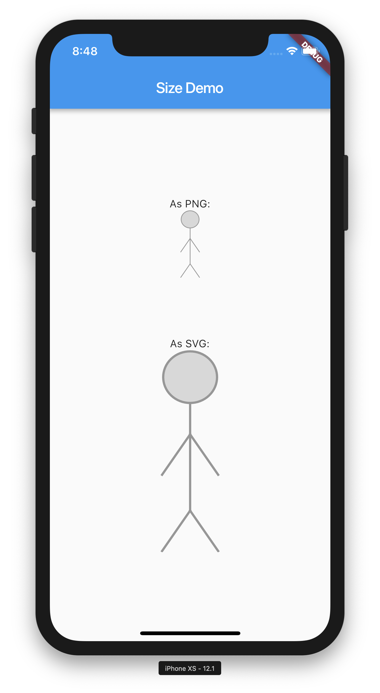

# Asset and export

* Asset is a stick man
* Asset is designed at 27 x 90 points
* Expected to appear roughly same size on devices
* From Sketch export as PNG to "all Flutter sizes" (cover most Android and iOS devices): 1.5x, 2.0x, 3.0x, 4.0x
* Exports in "assets" directory
* The 1x export is 27 x 90 pixels, 2x is 54 x 180 pixels and so on.
* Export also as SVG and is has size 27x90 (width="27px" height="90px" viewBox="0 0 27 90"). In [svg](svg) directory.
* [size_demo_overview.pdf](size_demo_overview.pdf) is an export of all the Sketch file.

# Actual sizes

* Appear on screen roughly of size 5 x 18 mm in Sketch at 100 % zoom. (MacBook Pro, 15 inch, 2017). Measured on screen with a physical measuring tape.
* Open SVG in Safary to preview. Size is 5 x 18 mm, same in Chrome.
* Created Flutter app and included the exported PNGs
* Via Flutter app, view PNGs on physical iPhone XS: ~ 4 x 15 mm
* Via Flutter app, view PNGs on physical iPhone 8: ~ 4 x 14 mm
* On all iOS devices and all Android devices, it will measure the same, give or take a few mm.
* Note that iPhone 8 is a 2x device and iPhone XS is a 3x devices. That is, iPhone XS uses more pixels to show the same point size. (see [size_demo_overview.pdf](size_demo_overview.pdf))

# flutter_svg

The Flutter project in the directory [asset_size_demo](asset_size_demo) demonstrate how the PNGs render correctly in the correct physical size (measured in mm) while rendering the SVG with flutter_svg will double the size on a 2x device (e.g. iPhone 8) and triple its size on a 3x device (e.g. iPhone XS).

iPhone 8          | iPhone XS
:----------------:|:------------------:
 | 